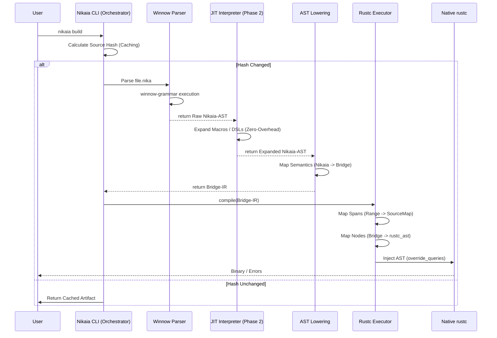

# Architecture Decision Record (ADR) 003: Hub-and-Spoke Compiler Architecture via Bridge-IR and Generic Orchestration

**Date:** 2026-02-18
**Status:** Accepted (Supersedes ADR 001 & ADR 002)
**Context:**
While implementing the initial Nikaia prototype (ADR 002), it became evident that coupling the language frontend directly to `rustc` internals (`rustc_driver`, `rustc_ast`) creates significant friction.
1.  **Instability:** `rustc_private` APIs change frequently on nightly builds, requiring constant refactoring of the entire language frontend.
2.  **Scalability:** The architecture defined in ADR 002 would require re-implementing the entire cargo-wrapping and compiler-bootstrapping logic for every future language added to the toolchain.
3.  **Testing Latency:** Testing the parser currently requires spinning up the full Rust compiler machinery, preventing fast iteration cycles.

**Objective:**
To decouple the specific language implementation (Nikaia) from the underlying compilation machinery. We introduce a stable intermediate protocol (**Bridge-IR**) and a reusable **Orchestrator**, transforming the project from a "Compiler for Nikaia" into a "Multi-Language Compiler Platform".

---

## 1. Architectural Decision

The architecture shifts from a linear pipeline to a **Hub-and-Spoke model**. The `rustc` integration is isolated into a generic platform, while specific languages (Nikaia) act as plugins that deliver a standardized Intermediate Representation.

### 1.1 The Bridge-IR (The Protocol)
Instead of generating `rustc_ast` directly, language frontends must target the **Bridge-IR**.
* **Nature:** A stable, pure-Rust data structure library (`bridge-ir` crate).
* **Characteristics:**
    * **State-Agnostic:** Contains no compiler-specific state (no `NodeId`, no `InternedString`).
    * **Simple Spans:** Uses `std::ops::Range<usize>` (raw byte offsets) instead of `rustc_span::Span`.
    * **Simplified Types:** Reduces complex Rust constructs to their semantic essentials (e.g., `BridgeFunction`, `BridgeStruct`, `BridgeExpr`).
    * **Macro-Free:** The Bridge expects fully expanded code. Macro expansion happens *before* this stage.
* **Stability Guarantee:** Changes to `rustc` internals only affect the generic executor, never the Bridge-IR. Frontends remain stable across compiler updates.

### 1.2 The Generic Orchestrator (Inversion of Control)
Logic for CLI wrapping, Caching, and Cargo instrumentation is extracted from the Nikaia CLI into a generic framework (`bridge-orchestrator`).
* **Mechanism:** The framework provides a `LanguageFrontend` trait.
* **Responsibility:** It handles `RUSTC_WORKSPACE_WRAPPER` injection, hash-based incremental compilation checks, and profile management.
* **Consumer:** The `nikaia-cli` becomes a thin shim that instantiates the Orchestrator with the Nikaia specific frontend configuration.

---

## 2. Detailed System Design

The system is physically separated into two distinct repositories to enforce strict boundary discipline.

### Repository A: The Compiler Platform (`parser-rustc-bridge`)
*Hosted independently. Contains no Nikaia-specific logic.*

| Component | Crate Name | Tech Stack | Responsibility |
| :--- | :--- | :--- | :--- |
| **Protocol** | `bridge-ir` | Pure Rust | Defines the `structs` and `enums` of the simplified AST. Zero dependencies. |
| **Framework** | `bridge-orchestrator` | Pure Rust | Wraps `cargo`, manages CLI args, implements build caching strategies. |
| **Backend** | `rustc-executor` | **Nightly Rust** | Links against `rustc_driver`. Converts `Bridge-IR` $\to$ `rustc_ast`. Manages `SourceMap` and `NodeId` generation. |

### Repository B: The Nikaia Implementation (`nikaia`)
*The language reference implementation. Depends on the Platform.*

| Component | Phase | Tech Stack | Responsibility |
| :--- | :--- | :--- | :--- |
| **Parser** | Phase 1 | `winnow-grammar` | Parses `.nika` source into **Nikaia-AST** (CST). Tracks byte offsets via `LocatingSlice`. |
| **Expander**| Phase 2 | **Pure Rust (JIT)**| The **Interpreter**. Traverses Nikaia-AST, executes Macros/DSLs in-memory, and produces a desugared AST. Eliminates compile-time latency. |
| **Lowering**| Phase 3 | Pure Rust | **Crucial Step.** Translates the desugared Nikaia-AST $\to$ `Bridge-IR`. Maps high-level Nikaia concepts (e.g., `@detached`) to generic Bridge constructs. |
| **CLI** | Phase 0 | Pure Rust | A thin binary entry point invoking `bridge_orchestrator::run(NikaiaFrontend)`. |

---

## 3. Data Flow & Compilation Pipeline

---

## 4. Implementation Strategy: The Vertical Slice

To validate this architecture without over-engineering, the implementation will proceed via a "Vertical Slice" covering a single language feature (Variable Declaration).

1.  **Define Bridge-IR:** Create `bridge-ir` with support strictly for `LetStmt` and primitive types.
2.  **Implement Executor:** Create `rustc-executor` capable of lowering `BridgeLetStmt` to `rustc_ast::ast::Local` and injecting it.
3.  **Implement Frontend:**
    * Use `winnow-grammar` to parse `let x = 5;` into `NikaiaLet`.
    * Implement `From<NikaiaLet>` for `BridgeLetStmt`.
4.  **Connect:** Wire the Orchestrator to run this pipeline.

---

## 5. Consequences

### Advantages
* **Zero-Overhead Metaprogramming:** The JIT (Phase 2) handles macro expansion *before* the code reaches the Bridge. The backend sees only optimized, static code.
* **Strict Isolation:** The frontend developers (Language Designers) never need to touch `rustc` data structures. They work exclusively with stable `Bridge-IR`.
* **Rapid Prototyping:** A new language frontend can be developed and tested purely by verifying it produces correct `Bridge-IR`. No compiler compilation is needed for tests.
* **Future Proofing:** Adding a second language (e.g., a DSL or script) requires no changes to the build tools or backend, only a new parser crate.

### Trade-offs
* **Double Mapping:** Data is transformed twice (`Source` $\to$ `Nikaia-AST` $\to$ `Bridge-IR` $\to$ `rustc_ast`). This introduces a negligible compile-time penalty in exchange for massive maintainability gains.
* **Lowest Common Denominator:** The `Bridge-IR` can initially only support features that have a direct representation in Rust. Exotic language features (e.g., continuations) require creative lowering strategies in the frontend or extensions to the Bridge.

### Risks
* **Span Misalignment:** If the frontend calculates byte offsets incorrectly, the backend's error messages will point to the wrong location. *Mitigation:* The `bridge-ir` will include validation utilities to ensure ranges are within file bounds.
