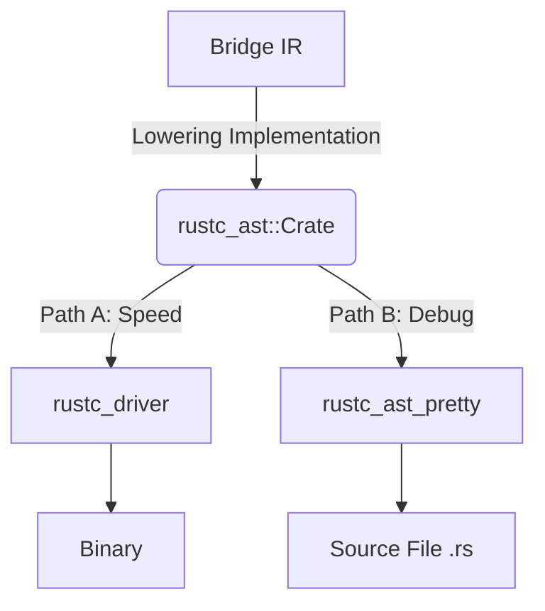

# Architecture Decision Record (ADR) 004: Unified Backend via `rustc_ast` Lowering

**Date:** 2026-02-18
**Status:** Accepted
**Context:**
As outlined in ADR-003, the `rustc-executor` is responsible for converting `Bridge-IR` into machine code. Currently, this is done via "Transpilation" (generating a `.rs` string and shelling out to `rustc`). 
For Phase 4, we want to integrate directly with `rustc_driver` for performance and correctness. However, retaining the ability to inspect the generated Rust source code is critical for debugging the compiler itself.
Maintaining two separate backends (one string-builder for debug, one AST-builder for production) would double the maintenance effort and lead to feature drift.

**Objective:**
To implement a direct integration with `rustc_driver` while keeping the "Transpilation/Debug" capability, with minimal maintenance overhead.

## 1. Architectural Decision

We will adopt a **"Unified AST Lowering"** strategy. We will discard the string-based source generator in favor of generating the internal `rustc_ast` data structures directly.

### The Pipeline

1.  **Input**: `BridgeModule` (Stable, Simple).
2.  **Transformation**: A single `Lowering` pass converts `BridgeModule` $\to$ `rustc_ast::Crate`.
    *   *Maintenance Benefit*: Logic for mapping constructs (e.g., `BridgeLet` -> `ast::Local`) exists in exactly one place.
3.  **Branching Strategy**:
    *   **Path A (Direct Execution / Release)**: The `rustc_ast::Crate` is fed directly into `rustc_interface::run_compiler`. This skips the parsing phase of rustc entirely.
    *   **Path B (Debug / Inspection)**: The `rustc_ast::Crate` is passed to `rustc_ast_pretty::pprust`. This standard library utility serializes the internal AST back into formatted Rust source code (`.rs`), which can be written to disk for inspection.

## 2. Consequences

### Advantages
*   **Zero Logic Duplication**: We don't write "code generation" logic (strings) and "AST generation" logic separately.
*   **Correctness**: Since we are building the AST directly, syntax errors in generated code are impossible (the type system prevents them), unlike with string concatenation.
*   **Performance**: Direct driver integration is significantly faster for large projects as it skips parsing and validation steps.

### Trade-offs
*   **Unstable API**: `rustc_ast` and `rustc_driver` are internal compiler APIs (`rustc_private`). They change frequently on Nightly.
    *   *Mitigation*: The `rustc-executor` crate is already isolated. We only need to update the lowering mappings when Rust nightly changes.
*   **Formatting**: The `rustc_ast_pretty` output is machine-generated and functional, but comments from the original Nikaia source (if any exist in Bridge) are lost (Bridge IR currently doesn't carry comments anyway).

## 3. Implementation Plan

1.  Add `rustc_private` feature gate to `rustc-executor`.
2.  Replace the current `generate_rust_source` (string builder) with `lower_to_ast`.
3.  Implement the switch flag `--debug-source` in the CLI.
    *   If set, run `pprust::print_crate` and write to disk.
    *   If not set (default), run the driver.
