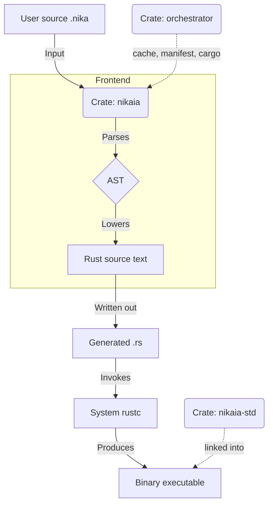

# Nikaia Toolchain Architecture

How the crates in the Nikaia workspace stack up. The separation they implement
is [ADR-003](specification/adr/adr-003.md): the language and the machinery that
compiles it are two programs, and the interface between them is Rust source
text.

## High-Level Stack

## Detailed Component Breakdown

### 1. The frontend and the CLI: `crates/nikaia`

*   **Role**: everything that knows what Nikaia means.
*   **Responsibilities**:
    *   **CLI**: arguments via `clap`; `nikaia build`, `nikaia run`,
        `nikaia lower-std`, and `--input` for a single file.
    *   **Parsing**: `winnow-grammar` (and `winnow`) parse `.nika` sources into
        a Nikaia-specific AST — over bytes, not over Rust tokens
        ([ADR-001](specification/adr/adr-001.md) D2).
    *   **AST**: the language constructs, in `src/ast`.
    *   **Checks**: types, contracts, `sync`, provenance, statement ordering —
        `src/check`, `src/contracts`.
    *   **Lowering**: `src/emit` turns the AST into Rust source text, in one
        pass, and writes a `SourceMap` beside it. It is the only code generator
        in the toolchain ([ADR-004](specification/adr/adr-004.md) D1).
    *   **Diagnostics**: `rustc --error-format=json` read back and reported
        against the `.nika` line that caused it
        ([ADR-012](specification/adr/adr-012.md)).
*   **Dependencies**: `orchestrator`, `winnow-grammar`.

### 2. The manager: `crates/orchestrator`

*   **Role**: the build machinery that is not Nikaia's — the part a second
    language would reuse unchanged ([ADR-003](specification/adr/adr-003.md) D2).
*   **Responsibilities**:
    *   **`cache`**: the build-cache key, the content-addressed store and
        `nikaia.lock` ([ADR-021](specification/adr/adr-021.md)).
    *   **`project`**: `nikaia.toml` rendered to a `Cargo.toml`, `cargo` driven
        over it, and `RUSTC_WORKSPACE_WRAPPER` injected so that a `.nika` file
        on a `rustc` command line is lowered and a crate from crates.io is not
        ([ADR-002](specification/adr/adr-002.md) D1).
    *   **`LanguageFrontend`**: the trait a frontend implements — source text in,
        Rust source text out, and nothing else crossing the line.

### 3. The standard library: `crates/nikaia-std`

*   **Role**: what a generated program links: the runtime, `fs`, `io`, `text`,
    `list`, `html`, the CLI surface.
*   Written in Nikaia where Stage 0 can lower it
    ([ADR-014](specification/adr/adr-014.md) D1), with the lowered `.rs`
    committed beside the `.nika` and regenerated by `nikaia lower-std`
    ([ADR-002](specification/adr/adr-002.md) D4). A project reaches it through
    a sysroot, not through a registry.

## Data Flow Example

1.  **Input**: `let x = 5`
2.  **Parser**: `ast::Stmt::Let { name: "x", value: LitInt(5), … }`
3.  **Emitter**: `let x = 5;` inside the generated `fn main`, plus the source
    map entry that points that line back at the `.nika` one.
4.  **rustc**: compiles the file to machine code.
